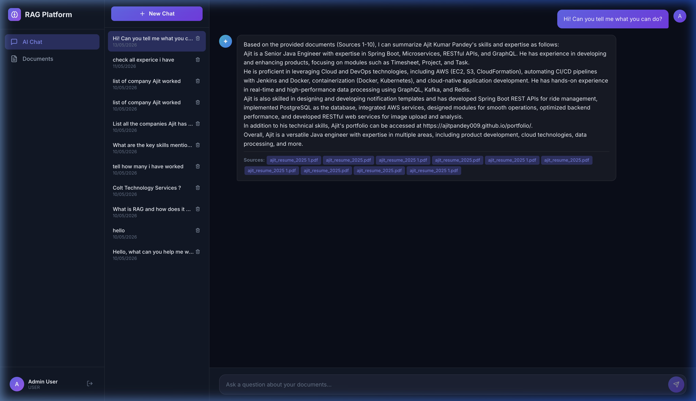
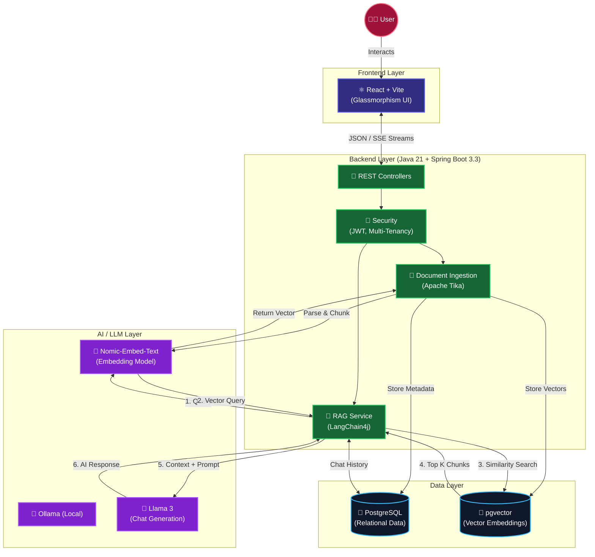

# 🧠 Enterprise RAG Platform

[](https://github.com/ajitpandey009/enterprise-rag-platform/actions/workflows/build.yml)


A **production-grade Retrieval-Augmented Generation (RAG)** platform for enterprise knowledge management. Upload internal documents (PDFs, TXT), ask natural language questions, and get AI-powered answers grounded exclusively in your organization's knowledge base.

---

## 🖼️ Application UI



---

## 🏗️ Architecture



## ✨ Features

### Core
- **RAG Pipeline** — Retrieve relevant document chunks and generate contextual AI answers
- **Document Ingestion** — Upload PDF and TXT files, auto-chunked and embedded
- **Semantic Search** — pgvector HNSW index for fast similarity search
- **Streaming Responses** — Real-time SSE token streaming (ChatGPT-like experience)
- **Chat Memory** — Session-based conversation history

### Enterprise
- **JWT Authentication** — Stateless token-based auth with refresh tokens
- **Role-Based Access Control** — USER, ADMIN, SUPER_ADMIN roles
- **Multi-Tenant Isolation** — Tenant-scoped data via ThreadLocal context
- **Audit Logging** — Immutable audit trail for all actions
- **Request Tracing** — Correlation IDs for end-to-end AI request tracing
- **Token Usage Tracking** — LLM cost monitoring per request
- **Spring Retry** — Exponential backoff for LLM API resilience
- **Swagger/OpenAPI** — Interactive API documentation

### Tech Stack
| Layer | Technology |
|-------|-----------|
| Backend | Java 21, Spring Boot 3.3, LangChain4j |
| AI/LLM | Ollama (llama3) or OpenAI (GPT-4o) |
| Embeddings | nomic-embed-text or text-embedding-3-small |
| Database | PostgreSQL 16 + pgvector |
| Frontend | React 18, Vite, React Router |
| Auth | JWT (jjwt), BCrypt, Spring Security |
| Docs | Swagger UI (springdoc-openapi) |
| Infra | Docker, Docker Compose |

---

## 🚀 Quick Start

### Prerequisites
- Docker & Docker Compose
- 8GB+ RAM (Ollama needs ~4GB)

### 1. Clone and Start

```bash
# Start all services
docker-compose up -d

# Wait for Ollama to pull models (first time takes a few minutes)
docker logs -f rag-ollama-init
```

### 2. Access

| Service | URL |
|---------|-----|
| Frontend | http://localhost:3000 |
| Backend API | http://localhost:8080 |
| Swagger UI | http://localhost:8080/swagger-ui.html |
| Ollama | http://localhost:11434 |

### 3. First Steps
1. Open http://localhost:3000
2. Register a new account
3. Navigate to **Documents** → Upload sample files from `sample-docs/`
4. Navigate to **AI Chat** → Ask questions about your documents

---

## 🛠️ Local Development

### Backend

```bash
# Requires: Java 21, Maven, PostgreSQL with pgvector, Ollama running

# Start PostgreSQL with pgvector
docker run -d --name rag-pg \
  -e POSTGRES_DB=ragplatform \
  -e POSTGRES_USER=raguser \
  -e POSTGRES_PASSWORD=ragpassword \
  -p 5432:5432 \
  pgvector/pgvector:pg16

# Start Ollama and pull models
ollama serve
ollama pull llama3
ollama pull nomic-embed-text

# Run backend
cd enterprise-rag-platform
./mvnw spring-boot:run
```

### Frontend

```bash
cd frontend
npm install
npm run dev  # Runs on http://localhost:3000
```

---

## 📡 API Reference

### Authentication
```
POST /api/auth/register  — Register new user
POST /api/auth/login     — Login, returns JWT
```

### Documents
```
POST   /api/documents/upload  — Upload document (multipart/form-data)
GET    /api/documents         — List user's documents
GET    /api/documents/{id}    — Get document details
DELETE /api/documents/{id}    — Delete document + chunks
```

### Chat
```
POST   /api/chat/ask             — Ask question (full response)
GET    /api/chat/stream?question= — Stream response via SSE
POST   /api/chat/sessions        — Create chat session
GET    /api/chat/sessions        — List sessions
GET    /api/chat/sessions/{id}   — Get session with messages
DELETE /api/chat/sessions/{id}   — Delete session
```

### Admin
```
GET /api/admin/audit-logs  — View audit logs (ADMIN only)
GET /api/admin/stats       — Platform statistics
```

---

## 📋 Sample Prompts

After uploading the sample documents, try these questions:

1. **"What technology stack does our platform use?"**
2. **"What is the incident response procedure for P1 incidents?"**
3. **"What is the escalation matrix for critical incidents?"**
4. **"How is our system deployed to production?"**
5. **"What monitoring tools do we use?"**
6. **"What is the response time for P2 incidents?"**

---

## ⚙️ Configuration

### Switching to OpenAI

```bash
# Set environment variables
export OPENAI_API_KEY=sk-your-key
export SPRING_PROFILES_ACTIVE=openai

# Or in docker-compose, add to backend environment:
SPRING_PROFILES_ACTIVE: openai
OPENAI_API_KEY: sk-your-key
```

### Key Configuration Properties

| Property | Default | Description |
|----------|---------|-------------|
| `app.rag.chunk-size` | 500 | Characters per document chunk |
| `app.rag.chunk-overlap` | 50 | Overlap between chunks |
| `app.rag.max-results` | 5 | Max chunks retrieved per query |
| `app.rag.min-score` | 0.5 | Minimum similarity score |
| `app.pgvector.dimension` | 768 | Embedding vector dimension |
| `app.jwt.expiration-ms` | 86400000 | JWT token expiry (24h) |

---

## 📁 Project Structure

```
enterprise-rag-platform/
├── pom.xml                        # Maven build config
├── Dockerfile                     # Backend container
├── docker-compose.yml             # Full stack orchestration
├── .env.example                   # Environment template
│
├── src/main/java/com/enterprise/rag/
│   ├── RagPlatformApplication.java    # Main entry point
│   ├── config/                        # Spring & LangChain4j config
│   │   ├── LangChain4jConfig.java     # PgVector store setup
│   │   ├── AsyncConfig.java           # Thread pool for async processing
│   │   └── OpenApiConfig.java         # Swagger documentation
│   ├── controller/                    # REST API endpoints
│   │   ├── AuthController.java
│   │   ├── ChatController.java
│   │   ├── DocumentController.java
│   │   └── AdminController.java
│   ├── dto/                           # Request/Response DTOs
│   ├── exception/                     # Global exception handling
│   ├── ingestion/                     # Document processing pipeline
│   │   └── DocumentIngestionService.java
│   ├── model/                         # JPA entities
│   ├── observability/                 # Audit, tracing, token tracking
│   ├── rag/                           # RAG pipeline
│   │   ├── RagService.java            # Core RAG orchestrator
│   │   └── StreamingRagService.java   # SSE streaming
│   ├── repository/                    # Spring Data JPA repositories
│   ├── security/                      # JWT auth, RBAC, tenant context
│   └── service/                       # Business services
│
├── src/main/resources/
│   ├── application.yml                # Multi-profile configuration
│   └── db/migration/
│       └── V1__init_schema.sql        # Flyway DB migration
│
├── frontend/                          # React application
│   ├── src/
│   │   ├── App.jsx
│   │   ├── index.css                  # Dark glassmorphism theme
│   │   ├── pages/
│   │   │   ├── ChatPage.jsx
│   │   │   ├── DocumentsPage.jsx
│   │   │   └── LoginPage.jsx
│   │   ├── components/
│   │   │   └── Sidebar.jsx
│   │   └── services/
│   │       └── api.js                 # Axios + SSE client
│   ├── Dockerfile
│   └── nginx.conf
│
└── sample-docs/                       # Sample documents for testing
    ├── sample-architecture.txt
    └── sample-sop.txt
```

---

## 📊 Database Schema

See [V1__init_schema.sql](src/main/resources/db/migration/V1__init_schema.sql) for the complete schema including:

- **tenants** — Multi-tenant root
- **users** — Auth with BCrypt passwords and roles
- **documents** — Uploaded file metadata with status tracking
- **document_chunks** — Text segments with pgvector embeddings (HNSW indexed)
- **chat_sessions** — Conversation containers
- **chat_messages** — Messages with token usage and source references
- **audit_logs** — Immutable action audit trail

---

## 📝 License

This project is provided for educational and enterprise internal use.
